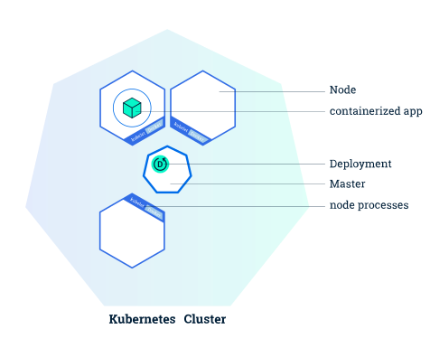
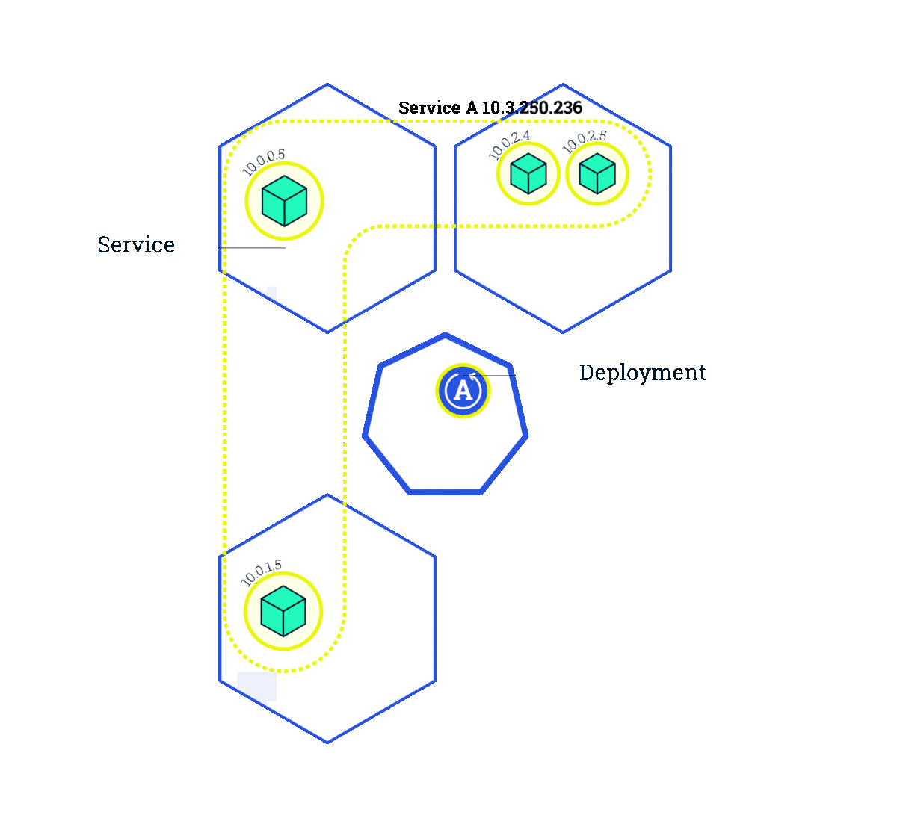

# Container Management

From the previous section you should be familiar with using Docker to build containers, run them locally and sharing them using a registry. This is great for developing locally and collaborating with small groups but is not very practical for working in large organizations or managing production environments. In order for containers to be a useful solution for companies which strive to be highly performant at developing and releasing software we need to be able to manage containers in a way that is consistent and easy to manage and automate.

# Kubernetes

There are many different solutions for managing containers but Kubernetes has become one of the most popular and widely used platforms. It is part of a large ecosystem of tools and projects organized by the [Cloud Native Computing Foundation (CNCF)](https://www.cncf.io/) which drives a lot of the development and support for containerized applications. So what is Kubernetes?

> Kubernetes is a portable, extensible open-source platform for managing containerized workloads and services, that facilitates both declarative configuration and automation. Read more at [kubernetes.io: What is Kubernetes](https://kubernetes.io/docs/concepts/overview/what-is-kubernetes/).

If you are still having a difficult time understanding what Kubernetes is that is OK. Kubernetes is complicated and we are not going to try to explain all of it in this section. All that you really need to know right now is that you can use it to run Docker containers.

## Architecture

### Cluster

A Kubernetes **cluster** is a set of node machines for running containerized applications. The Kubernetes Master is a collection of three processes that run on a single node in your cluster, which is designated as the master node. Those processes are: kube-apiserver, kube-controller-manager and kube-scheduler.

### Node
The **nodes** in a cluster are the machines (VMs, physical servers, etc) that run the applications and workflows. The Kubernetes master controls each node.

## Design
Kubernetes is declarative by design. When you want to change something in the cluster, you simply create/update/delete the resources from etcd via the API server. Various controllers then respond to this change by converging the system to comply with the newly declared state. To best understand, check out this drawing from [Julia Evans](https://jvns.ca/blog/2017/06/04/learning-about-kubernetes/):

?>**Declarative:** you declare what you want the system to do - a desired state - and the system will align towards that state. In Kubernetes, you create an API object to represent what you want the system to do. And all the components in the system work to drive towards that state, until the object is deleted.

## Pods
A **Pod** is the basic execution unit of a Kubernetes application – the smallest and simplest unit in the Kubernetes object model that you create or deploy.

## Services
A **Service** is an abstraction which defines a logical set of Pods and a policy by which to access them.

## Deployments

Deployments abstract away the low level details of managing Pods. Behind the scenes, **Deployments** rely on **ReplicaSets** to manage starting, stopping, scaling, and restarting the Pods if they happen to go down for some reason. Below is an example illustration of a deployment.

# Minikube + Docker

If you think understanding what Kubernetes is is difficult, installing it can be even harder. Lucky for you Minikube makes it easy to get started with Kubernetes.

> Minikube runs a single-node Kubernetes cluster inside a VM on your laptop for users looking to try out Kubernetes or develop with it day-to-day. -[kubernetes.io: Running Kubernetes Locally via Minikube](https://kubernetes.io/docs/setup/minikube/)

# Docker Desktop + Kubernetes

To make things even easier Docker Desktop for Mac and Windows also includes a standalone Kubernetes instance similar to Minikube. To start up the Kubernetes instance with Docker Desktop for Mac follow the instructions at [docs.docker.com](https://docs.docker.com/docker-for-mac/#kubernetes). See it's so easy you probably installed it already and didn't even know it :)

---

In the following exercises we are going to use both Minikube and Docker Desktop Kubernetes. Having both installed at the same time is fine but for performance reasons you should not run both at the same time. If you are using Minikube make sure to select *Docker Desktop* -> *Kubernetes* -> *Disable local cluster* first and if you are using the Docker Desktop Kubernetes instance run `minikube stop` first and if you are not using either turn them both off to save your laptops battery.

# Exercise 1: Hello Minikube

1. Use the instructions in the link above to install Minikube.
2. Follow the instructions in the [Hello Minikube](https://kubernetes.io/docs/tutorials/hello-minikube/#) tutorial.

### Exercise Deliverables

- Install and understand the basics of using Minikube.
- Understand the basic of creating, viewing and deleting deployments, pods and services in Kubernetes.
- How are Kubernetes deployments, pods and services related.

# Exercise 2: Kubernetes on Docker Desktop

1. Use the instructions in the link above to enable the Kubernetes cluster with Docker Desktop.
2. Follow the instructions in the [Docker: Deploy on Kubernetes](https://docs.docker.com/docker-for-mac/kubernetes/) tutorial.

### Exercise Deliverables

- Understand how to start up and use the standalone Kubernetes cluster included with Docker Desktop.
- Understand advantages of using Minikube vs Kubernetes with Docker Desktop.

# Exercise 3: Deeper Dive

Research the [kubectl](https://kubernetes.io/docs/reference/kubectl/overview/) command line tool and experiment with different commands.

### Exercise Deliverables

- What kubectl commands did you find useful or interesting?
- What are resources in Kubernetes? Which ones did you use in this section?

# Deliverables

- What are some features of Kubernetes? Why would an organization use it?
- What is the difference between a standalone Kubernetes instance like Minikube and a full Kubernetes cluster and what are the use cases for each?
