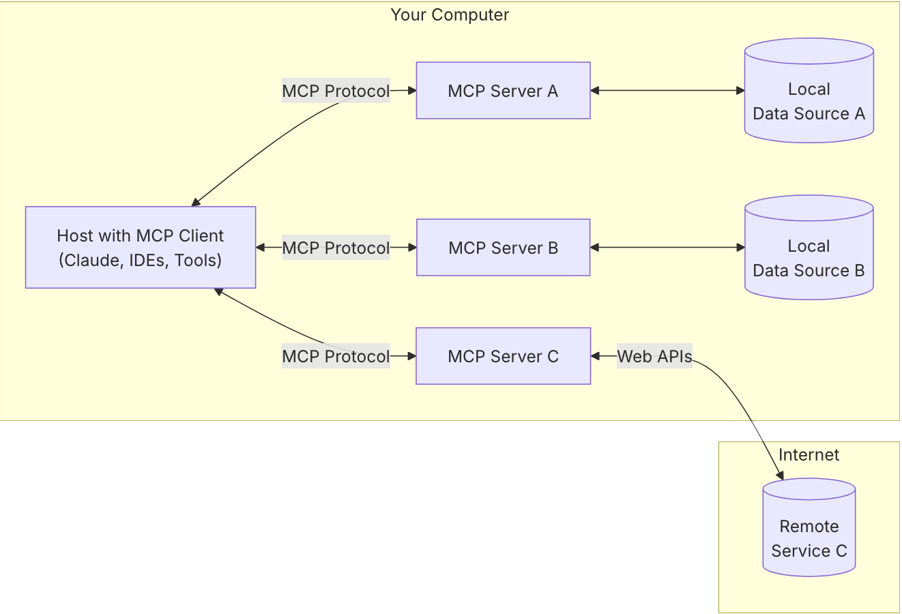

---
docs/3-AI-Engineering/3.2-mcp.md:
  category: AI Engineering
  estReadingMinutes: 12
---

# MCP: Model Context Protocol

MCP stands for Model Context Protocol - an open protocol that standardizes how applications provide context to Large Language Models (LLMs). Think of MCP like a USB-C port for AI applications: just as USB-C provides a standardized way to connect your devices to various peripherals, MCP provides a standardized way to connect AI models to different data sources and tools.

## What is the Model Context Protocol?

The Model Context Protocol is a client-server architecture that enables AI applications to access and utilize various data sources and tools through a standardized interface. It allows LLMs to interact with your local files, databases, APIs, and other resources in a secure and consistent manner.

### Core Components

- **MCP Hosts**: Programs like Claude Desktop, IDEs, or AI tools that want to access data through MCP
- **MCP Clients**: Protocol clients that maintain 1:1 connections with servers
- **MCP Servers**: Lightweight programs that each expose specific capabilities through the standardized Model Context Protocol
- **Local Data Sources**: Your computer's files, databases, and services that MCP servers can securely access
- **Remote Services**: External systems available over the internet (e.g., through APIs) that MCP servers can connect to

## Key Features of MCP

### Resources

Resources in MCP provide a way for AI models to access various types of data, such as:

- Files on your local system
- Content from databases
- Information from web APIs
- Code repositories

Resources are identified by URIs (Uniform Resource Identifiers) and can be discovered and accessed by the AI model as needed.

### Tools

Tools allow AI models to perform actions beyond just accessing data. MCP tools can:

- Execute code
- Call APIs
- Perform system operations
- Process data
- Interact with external services

Tools are defined with clear input/output specifications and can be discovered dynamically by the AI application.

### Prompts

Prompts in MCP provide structured templates for AI interactions. They help:

- Standardize common interaction patterns
- Ensure consistent AI responses
- Embed contextual information
- Support multi-step workflows

### Roots

Roots provide entry points into your data, helping AI models understand where to start exploring. They can represent:

- Project directories
- Document collections
- Knowledge bases
- Application contexts

## Benefits of MCP

1. **Interoperability**: Connect any MCP-compatible AI model to any MCP-compatible data source or tool
2. **Security**: Keep your data within your infrastructure and control what the AI model can access
3. **Flexibility**: Switch between different AI providers without changing your data integrations
4. **Extensibility**: Create custom MCP servers for specialized data sources or tools
5. **Standardization**: Follow best practices for AI-data interactions

## MCP Implementation

### Client-Side Implementation

- Integrating MCP clients into AI applications
- Discovering and connecting to MCP servers
- Handling resource and tool requests
- Managing authentication and security

### Server-Side Implementation

- Creating custom MCP servers
- Exposing resources and tools
- Implementing security controls
- Optimizing performance

## MCP in Practice

### Common Use Cases

- **Development Environments**: Enabling AI coding assistants to access project files and run code
- **Data Analysis**: Allowing AI models to query databases and analyze results
- **Document Processing**: Letting AI models access and process document collections
- **System Automation**: Using AI to automate tasks across different systems

### Example Applications

- Claude Desktop with filesystem access
- GitHub Copilot with project context
- Windsurf Cascade with tool execution
- AI-powered data analysis tools

## Getting Started with MCP

1. **Choose MCP-compatible AI applications**: Look for applications that support the Model Context Protocol
2. **Install MCP servers**: Set up servers for the data sources and tools you want to use
3. **Configure connections**: Connect your AI application to your MCP servers
4. **Start interacting**: Use your AI application with enhanced context and capabilities

# Deliverables

- How might the Model Context Protocol change the way developers interact with AI tools in their workflow?
- **Container Runtimes**: Docker, containerd
- **Orchestration**: Kubernetes, Kubeflow
- **Pipeline Tools**: MLflow, Kubeflow Pipelines, Airflow
- **Model Serving**: TensorFlow Serving, TorchServe, Seldon Core

In the next section, we'll explore how agentic IDEs are transforming the way we develop and deploy AI applications.
