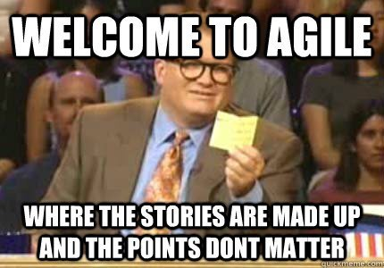
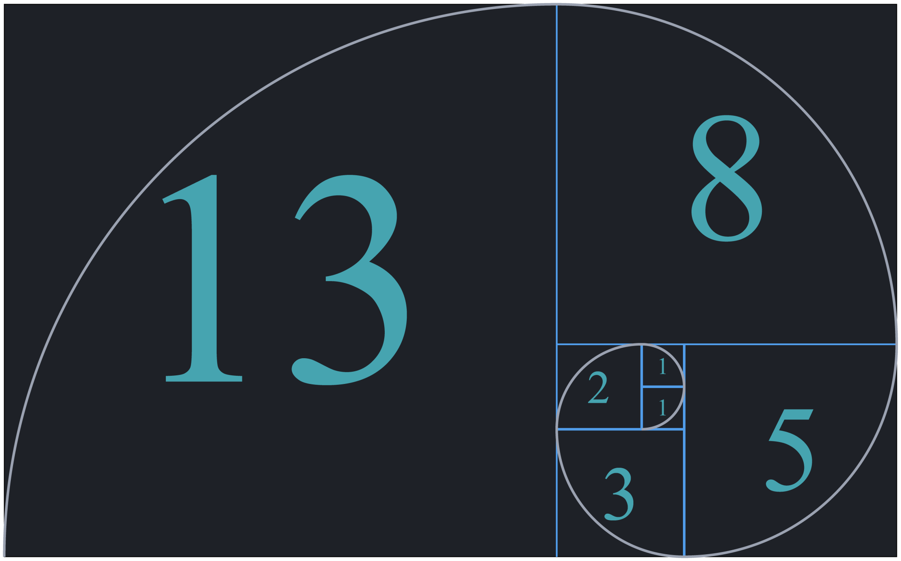

# Agile
The Agile mindset is focused on collaboration and the ability to adapt to change quickly while focusing on delivering value to the customer. Agile utilizes an iterative approach that allows teams to respond to changing priorities and customer needs by working in small incriments.


>Users don't know what they want until they see working software. - Humphrey's Law

## Software delivery lifecycle
Traditionally, software development would endure long release cycles under a siloed process. In iterative delivery, these phases are reduced to smaller cycles with increased feedback loops.

SDLC tools are used to manage this work from a large portfolio level down to the team and individual level using tickets and boards with powerful integrations across the toolchain.

## Agile frameworks
Within Agile, there are many different frameworks, each approaching work, team composition, and cadence differently. The most popuar are Kanban and Scrum, each approaching work and cadence separately with a similar goal of swarming, iterating, and collaborating.


## Kanban
Kanban is a popular framework that focuses on consistent flow of work. Teams are able to leverage just-in-time principles by matching the amount of work in progress (WIP) to the team's capacity. This gives teams more flexible planning options, faster output, clearer focus, and transparency throughout the development cycle. It requires real-time communication of capacity and full transparency of work. Work items are represented visually on a kanban board, allowing team members to see the state of every piece of work at any time. (source)

Rather than a presecriptive set of a team's cadence, kanban promotes constant flow and manages work by consider work-in-progress limits. Important measures on a team is throughput, lead time, and cycle time.

- Emphasis on visualizing work with a kanban board
- Primary determinate for work is work-in-progress
- Implements pull system to reduce waste
- Can be used for continuous deployment

### Work-in-progress (WIP)
In agile development, work in progress (WIP) limits set the maximum amount of work that can exist in each status of a workflow. Limiting the amount of work in progress makes it easier to identify inefficiency in a team's workflow. Bottlenecks in a team's delivery pipeline are clearly visible before a situation becomes dire.

>Too much WIP limits our ability to proactively put oneself in a position to prepare. Preparedness brings confidence to shape the future - rather than waiting to see what happens. - Dominica DeGrandis

### Goals and challenges
1. Size individual tasks consistently. When breaking down requirements and user stories, it's important to keep individual tasks to no more than 16 hours of work. Doing so increases the team's ability to estimate confidently, and it helps prevent bottlenecks.

2. Map WIP limits to the team’s skills. If a team has specialists on it, work in progress limits may differ when the specialist is involved. If bottlenecks occur, use the opportunity to educate other team members to add additional capacity for the specialist's skill sets and increase flow across the entire team.

3. Reduce idleness. When a team member has some downtime, encourage them to help an upstream or downstream team member. They'll contribute to the overall to the team, and learn something along the way!

4. Protect a sustainable engineering culture. Work in progress limits do not mean developers need to rush through work to avoid work overload in a particular status. They are meant to support solid agile engineering practices that protect the quality of the product and health of the code base.

## Workflow
Agile is focused on iterative delivery. This impacts how a team break downs their work and manages their work through the software development lifeycle. SDLC tools help manage this work.


## Work breakdown
In agile, stories from the basis of work items. Epics are a larger theme around a collection of stories, or they can be seen as a longer-lived goal. Subtasks can be broken out during sprint planning as a team or in-sprint engineers.

| Ticket | Purpose | Duration |
| --- | --- | --- |
| **Epic** | Large bodies of work, feature focused or higher, spans multiple sprints | 1-4 iterations |
| **Story** | Typical unit of work, driven by the product owner | 1 day |
| **Subtask** | Small amount of work that lives under a story or task | <1 day |

## Workflow
**Backlog.** The backlog is a list of all work items that are waiting to be brought in for development. In Kanban, items are pulled from backlog; in Scrum, items are brought in a planning.

**Kanban Board.** Teams use kanban boards to track their work in progress (WIP), using columns *To Do, In Progress, and Done*. During standup, teams may "walk the board" and review the status or blockers of each item on the board.

>Using WIP limits can help your team reduce multitasking and focus on finishing the work that matters most.<br><i>- Dominica DeGrandis</i>


## Stories
A user story is a promise to have a future conversation; it is not meant to document every aspect of the work, as you might in a series of traditional requirements statements. (source)

In initial phases, user stories can be captured in various mediums, from documents to project management software to index cards. Ultimately, stories should be captured, tracked, and prioritized in the issue-tracking software.

## How user stories help
- Shifts the focus from writing to talking
- Leverages natural language
- Focuses on functionality rather than system components
- Builds empathy for the user
- Encourages flexibility and collaboration
- What is user story?

A user story is an informal, natural language description of one or more features of a software system. User stories are often written from the perspective of an end user or user of a system. (source)

## Story format
A user statement contains the role, activity, value expressed in the following format:

```
As a ___
I want to ___
So that ___
```

## Acceptance criteria
Acceptance Criteria is a set of defined requirements that must be met in order to mark a story complete. This helps the team to identify if the story is done or not, as it should be simple to test the product increment against the acceptance criteria. Often this is written in Gherkin.

- Written as a set of statements
- Accompanies the story
- Each statement contains clear outcomes and pass / fail criteria
- Describes the intent, not a solution
- May include happy path, exceptions, or edge cases

## INVEST
The acronym INVEST helps to remember a widely accepted set of criteria, or checklist, to assess the quality of a user story. If the story fails to meet one of these criteria, the team may want to reword or refine it further.[(source)](https://www.agilealliance.org/glossary/invest/)

## Sizing


When it comes to determining how much work can a team bring in during a sprint, teams need to have a common base understanding of the time, difficulty, or complexity of the story. Proper sizing enables the team to increase flow, minimize rework, and stablize velocity. **It is easier to determine the relative complexity of a task rather than figuring out how much time it requires.** 

## Story pointing
Story pointing is an exercise that is completely relative to a team. Rather than determining capacity or tracking hours, points serve the purpose of determining how much risk is represented in accepting a story. Elements that impact estimation are:

- uncertainty
- complexity
- security risks
- size
- dependencies

?>Stories points should continue getting smaller and able to be completed in a day. Pointing becomes a simpler task as teams mature and more knowledgeable about story splitting.

## Fibonacci technique

People estimate stories with smaller points more accurately than stories with higher points. As the numbers increase, the difference between two succeeding numbers increases exponentially and leads to less accurate estimates. This is intentional, as most stories are often more complex than we realize. [(source)](https://en.wikipedia.org/wiki/Fibonacci_scale_(agile))

As team's adopt relative sizing, they must come to a common understanding of what a base unit of work is- a 1 point story. Activities like [agile poker](https://scrumpoker.online/) allow teams to collaborate, giving each team member to voice their opinion on how stories should be pointed and establishing the team's baseline of relative sizing.

## What is a spike?
Teams often mistakenly refer to spikes as research. Originated from eXtreme Programming (XP), spikes are a very simple solution to explore potential solutions. Spikes are experimental in nature. They should answer a specific question and should be timeboxed. The result should be a prototype, not a document.

Spikes represent a trade-off between a need to answer questions and a need to produce features. Product owners and delivery teams should carefully consider how much time and energy to devote to spikes, ensuring that the time is spent creating value by solving a technical problem or reducing uncertainty.

# Deliverable

Discuss why teams would choose an agile development workflow or a waterfall method.
