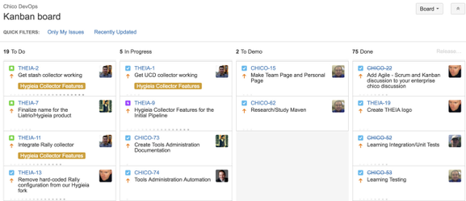

# Jira

Jira is an agile project management tool focued on providing visibility to your team through tickets.  

  

As you can see above, there are 4 stages that a ticket, or a task, can be in: To Do, In Progress, To Demo, and Done. As an team member moves the task from stage to stage, he or she can alter settings to notify their team, or comment on events that have taken place pertaining to his or her ticket. It is crucial to constantly be updating and commenting on your tickets; the transparency to your teammates will keep everything running more smoothly.

## Creating Effective Jira Tickets

#### Styling

 - Use proper formatting and make use of special insert options 
   - "Info" can be used for warnings such as version dependencies
   - User mentions (@name) should be used when possible
 - Every part of a ticket should be visually appealing to ensure readability
 - Use screenshots effectively
   - Captions should be accurate, not "Screen Shot 2019-02-25 at 2.07.34 PM"
 - Use syntax, grammar, capitalization, punctuation to your advantage
 - Remove any guesswork and make things as simple and direct as possible

#### Content

 - Write a ticket as if someone else is doing the work
 - It is better to be too descriptive than not descriptive enough
 - The summary should be updated with any relevant links
 - Solutions should be easily repeatable by anyone
 - A DOD (definition of done) in the summary is critical
   - This criteria should only have one interpretation 
 - Cite tickets in GitHub commits to have them referenced within the ticket automatically
   - Commit message format: <ticket> <commit message>
   - Example: THEIA-107 updated /theia directory path for easier buildability

## Two Main Frameworks of Agile 

### Scrum 

Take a look at the [Scrum Guide](https://www.scrumguides.org/scrum-guide.html). 

When to use **Scrum**?
 - Product teams
 - Need to measure rate of progress by using fixed time-boxes
 - Track big release milestones & goals

### Kanban

Here is a [ Kanban Guide](https://scrumorg-website-prod.s3.amazonaws.com/drupal/2018-04/2018%20Kanban%20Guide%20for%20Scrum%20Teams_0.pdf).

When to use **Kanban**?
 - Service teams
 - Tend to work as it comes up (continuous irregular inflow of work)
 - Planning is unimportant or irrelevant
 - Matured & self disciplined teams

## Deliverable

Discuss and understand how to create & maintain effective tickets and the Scrum & Kanban framework. 
