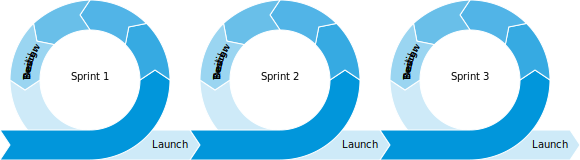
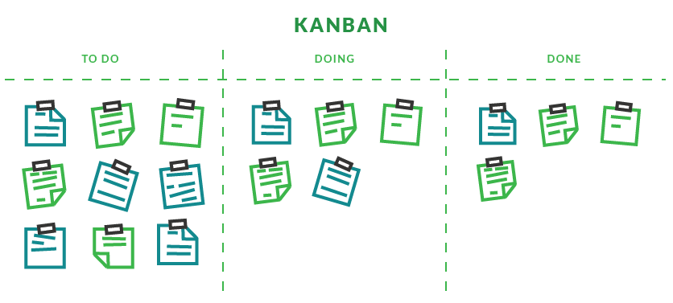
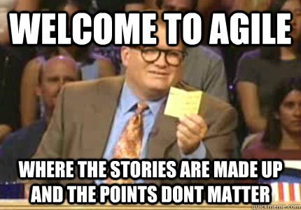

# Agile
The Agile mindset is focused on collaboration and the ability to adapt to change quickly while focusing on delivering value to the customer. Agile utilizes an iterative approach that allows teams to respond to changing priorities and customer needs by working in small incriments.



>Users don't know what they want until they see working software. - Humphrey's Law

## Software delivery lifecycle
Traditionally, software development would endure long release cycles under a siloed process. In iterative delivery, these phases are reduced to smaller cycles with increased feedback loops.

SDLC tools are used to manage this work from a large portfolio level down to the team and individual level using tickets and boards with powerful integrations across the toolchain.

## Agile frameworks
Within Agile, there are many different frameworks, each approaching work, team composition, and cadence differently. The most popuar are Kanban and Scrum, each approaching work and cadence separately with a similar goal of swarming, iterating, and collaborating.

## Scrum
Scrum is an agile framework for developing, delivering, and sustaining complex products. It is designed for teams of ten or fewer members (two pizza teams), who break their work into goals that can be completed within timeboxed iterations, called sprints, no longer than one month and most commonly two weeks. The scrum team track progress in time-boxed daily scrum meetings or stand-ups. At the end of the sprint, the team holds sprint review, to demonstrate the work done, and sprint retrospective to continuously improve. (source1, source2)

Scrum emphasizes collaboration around breaking goals into timeboxed intervals. Important metrics are sprint burndown, release burnup, and velocity.

- Work is allocated for a sprint, generally two weeks
- Promotes feedback loops with each sprint
- Finished work is seen as unused inventory or technical debt until the sprint is closed
- Does not support continuous deployment as release would not occur mid-sprint
- Encourages continuous improvement through reviews and retrospectives after each sprint

## Sprint Cadence
Scrum breaks work into timeboxed sprints. Generally sprints are one or two weeks, and should not be longer than two weeks. Shorter sprints provide more feedback which amplifies the team's learnings and guides better iterative delivery. Each sprint should have a 1-2 sentence goal describing a quick and easy statement for stakeholders to read and understand what the team is working on.

## Team Composition
Product teams work in a way where the delivery team agrees to deliver on a promise. Together, they have the responsibility to fullfil that promise, but how they organize in a way to execute on that promise is up to them.


Traditionally, agile scrum teams organize are made up of the product owner and the development team. However, teams should be oriented in such a way that the team members can self-organize to accomplish the task. Additionally, teams should be cross-functional to help support one another and learn from one another to complete work items. (source)

>Nothing is more effective than a cross-functional team with a well-defined backlog.- *Dominica DeGrandis*

## Development team: redefining a developer
The development team is composed of the people doing the engineering and development. They are empowered to self-organize and manage their work, optimizing their effectiveness and efficency. This empowers the people closest to the work to do what’s needed to solve the problem. The developer role means a team member who has the right skills, as part of the team to do the work, including designers, writers, programmers. Although there are different skillsets present across team members, together they form a unified cross-functional team.

### The development team’s responsibilities include:

- Delivering the work through the sprint.
- To ensure transparency during the sprint they meet daily at the daily standup.

## Product owner: setting clear direction
Agile teams are, by design, flexible and responsive, and it is the responsibility of the product owner to ensure that they are delivering the most value. The business is represented by the product owner who tells the development team what is important to deliver. Trust between these two roles is crucial.

The product owner should not only understand the customer, but also have a vision for the value that the team is delivering to the customer. The product owner also balances the needs of other stakeholders in the organization.

### The product owner's responsibilities include:

- *Managing the scrum backlog* - Ultimately they are responsible for the backlog that the development team pulls in to deliver. That means the product owner should know about everything that is in the backlog and other people that add items to the product backlog should ensure that they communicate with the product owner.
- *Stakeholder management* - Any product will have many stakeholders involved ranging from users, customers, governance and organizational leadership. The product owner will have to work with all these people to effectively ensure that the development team is delivering value.

## Scrum master: holding it all together
Some teams may have a **scrum master** who is responsible for gluing everything together and ensuring that scrum is being done well. In practical terms, that means they help the product owner define value, the development team deliver the value, and the scrum team to get to get better.

## Ceremonies
Establishing a base for team's ceremonies help create a rythym and cadence. Utilizing agile practices of the scrum framework, teams typically would have the follow the core ceremonies to ensure teams are aligned, focusing on high prioritized items, and support continuous learning efforts.


| Ceremony | Purpose | Duration | Audience |
| -- | -- | -- | -- |
| **Refinement** | Groom and refine backlog stories, update with outstanding questions and point stories that are fully refined. | 1hr | Everyone |
| **Sprint Planning** | Confirm backlog stories are fully groomed and pointed and decide which stories to pull into the upcoming sprint. | 30min | Everyone |
| **Stand up** | Daily team touch point. Walk the board or discuss work accomplished yesterday, work planned for today, and blockers  | 15 min | Everyone |
| **Demo & Retro** | Demonstrate code changes to the team, product owner, and stakeholders. Discuss what went well and what improvements can be made. | 1hr | Everyone |

3 Amigos, part of BDD practice, include 30 minute sesions with relevant team members to surface questions and assumptions around product, development, and testing. Although some teams decide to incorporate this into a regularly cadenced ceremony, other teams follow the recommendation to have them adhoc.

## Backlog refinement
A well-prioritized agile backlog not only makes release and iteration planning easier, it broadcasts all the things your team intends to spend time on - including internal work that the customer will never notice. This helps set expectations with stakeholders and other teams, especially when they bring additional work to you, and makes engineering time a fixed asset.

## Sprint planning
The purpose of sprint planning is to define what can be delivered in the sprint and how that work will be achieved. Sprint planning is done in collaboration with the whole scrum team. A well-defined backlong brought into sprint should result in an efficient session reviewing the stories, points, and acceptance criteria.

## Stand up
Each day, the scrum team gathers to discuss the day's work. Although it can easily become a mundane meeting, it should remain as a sharp, crip, critical touchpoint. Able to led by anyone on the team, there are two commmon approaches to running standup:

1. **Walk the board.** This approach looks at the tickets on the board and reviews the status of each. The emphasis of WTB is the work in progress.

2. **Around the room.** This approach asks everyone on the team the following questions, highlighting individual progress and blockers.
- What do I do yesterday?
- What am I doing today?
- Are there any blockers?

## Sprint review
As teams close out their sprint, they should dedicate an hour to conduct a demo and retrospective. This allows teams to showcase their work to one another and to stakeholders. Retros enable teams to consider what worked well and what did not work well, providing opportunities for ongoing learning and improvment.

## Kanban
Kanban is a popular framework that focuses on consistent flow of work. Teams are able to leverage just-in-time principles by matching the amount of work in progress (WIP) to the team's capacity. This gives teams more flexible planning options, faster output, clearer focus, and transparency throughout the development cycle. It requires real-time communication of capacity and full transparency of work. Work items are represented visually on a kanban board, allowing team members to see the state of every piece of work at any time. (source)

Rather than a presecriptive set of a team's cadence, kanban promotes constant flow and manages work by consider work-in-progress limits. Important measures on a team is throughput, lead time, and cycle time.

- Emphasis on visualizing work with a kanban board
- Primary determinate for work is work-in-progress
- Implements pull system to reduce waste
- Can be used for continuous deployment

### Work-in-progress (WIP)
In agile development, work in progress (WIP) limits set the maximum amount of work that can exist in each status of a workflow. Limiting the amount of work in progress makes it easier to identify inefficiency in a team's workflow. Bottlenecks in a team's delivery pipeline are clearly visible before a situation becomes dire.

>Too much WIP limits our ability to proactively put oneself in a position to prepare. Preparedness brings confidence to shape the future - rather than waiting to see what happens. - Dominica DeGrandis

### Goals and challenges
1. Size individual tasks consistently. When breaking down requirements and user stories, it's important to keep individual tasks to no more than 16 hours of work. Doing so increases the team's ability to estimate confidently, and it helps prevent bottlenecks.

2. Map WIP limits to the team’s skills. If a team has specialists on it, work in progress limits may differ when the specialist is involved. If bottlenecks occur, use the opportunity to educate other team members to add additional capacity for the specialist's skill sets and increase flow across the entire team.

3. Reduce idleness. When a team member has some downtime, encourage them to help an upstream or downstream team member. They'll contribute to the overall to the team, and learn something along the way!

4. Protect a sustainable engineering culture. Work in progress limits do not mean developers need to rush through work to avoid work overload in a particular status. They are meant to support solid agile engineering practices that protect the quality of the product and health of the code base.

## Workflow
Agile is focused on iterative delivery. This impacts how a team break downs their work and manages their work through the software development lifeycle. SDLC tools help manage this work.



## Work breakdown
In agile, stories from the basis of work items. Epics are a larger theme around a collection of stories, or they can be seen as a longer-lived goal. Subtasks can be broken out during sprint planning as a team or in-sprint engineers.

| Ticket | Purpose | Duration |
| --- | --- | --- |
| **Epic** | Large bodies of work, feature focused or higher, spans multiple sprints | 1-4 iterations |
| **Story** | Typical unit of work, driven by the product owner | 1 day |
| **Subtask** | Small amount of work that lives under a story or task | <1 day |

## Workflow
**Backlog.** The backlog is a list of all work items that are waiting to be brought in for development. In Kanban, items are pulled from backlog; in Scrum, items are brought in a planning.

**Kanban Board.** Teams use kanban boards to track their work in progress (WIP), using columns *To Do, In Progress, and Done*. During standup, teams may "walk the board" and review the status or blockers of each item on the board.

>Using WIP limits can help your team reduce multitasking and focus on finishing the work that matters most.<br><i>- Dominica DeGrandis</i>


## Stories
A user story is a promise to have a future conversation; it is not meant to document every aspect of the work, as you might in a series of traditional requirements statements. (source)

In initial phases, user stories can be captured in various mediums, from documents to project management software to index cards. Ultimately, stories should be captured, tracked, and prioritized in the issue-tracking software.

## How user stories help
- Shifts the focus from writing to talking
- Leverages natural language
- Focuses on functionality rather than system components
- Builds empathy for the user
- Encourages flexibility and collaboration
- What is user story?

A user story is an informal, natural language description of one or more features of a software system. User stories are often written from the perspective of an end user or user of a system. (source)

## Story format
A user statement contains the role, activity, value expressed in the following format:

```
As a ___
I want to ___
So that ___
```

## Acceptance criteria
Acceptance Criteria is a set of defined requirements that must be met in order to mark a story complete. This helps the team to identify if the story is done or not, as it should be simple to test the product increment against the acceptance criteria. Often this is written in Gherkin.

- Written as a set of statements
- Accompanies the story
- Each statement contains clear outcomes and pass / fail criteria
- Describes the intent, not a solution
- May include happy path, exceptions, or edge cases

## INVEST
The acronym INVEST helps to remember a widely accepted set of criteria, or checklist, to assess the quality of a user story. If the story fails to meet one of these criteria, the team may want to reword or refine it further.[(source)](https://www.agilealliance.org/glossary/invest/)

## Sizing


When it comes to determining how much work can a team bring in during a sprint, teams need to have a common base understanding of the time, difficulty, or complexity of the story. Proper sizing enables the team to increase flow, minimize rework, and stablize velocity. **It is easier to determine the relative complexity of a task rather than figuring out how much time it requires.** 

## Story pointing
Story pointing is an exercise that is completely relative to a team. Rather than determining capacity or tracking hours, points serve the purpose of determining how much risk is represented in accepting a story. Elements that impact estimation are:

- uncertainty
- complexity
- security risks
- size
- dependencies

?>Stories points should continue getting smaller and able to be completed in a day. Pointing becomes a simpler task as teams mature and more knowledgeable about story splitting.

## Fibonacci technique

People estimate stories with smaller points more accurately than stories with higher points. As the numbers increase, the difference between two succeeding numbers increases exponentially and leads to less accurate estimates. This is intentional, as most stories are often more complex than we realize. [(source)](https://en.wikipedia.org/wiki/Fibonacci_scale_(agile))

As team's adopt relative sizing, they must come to a common understanding of what a base unit of work is- a 1 point story. Activities like [agile poker](https://scrumpoker.online/) allow teams to collaborate, giving each team member to voice their opinion on how stories should be pointed and establishing the team's baseline of relative sizing.

## What is a spike?
Teams often mistakenly refer to spikes as research. Originated from eXtreme Programming (XP), spikes are a very simple solution to explore potential solutions. Spikes are experimental in nature. They should answer a specific question and should be timeboxed. The result should be a prototype, not a document.

Spikes represent a trade-off between a need to answer questions and a need to produce features. Product owners and delivery teams should carefully consider how much time and energy to devote to spikes, ensuring that the time is spent creating value by solving a technical problem or reducing uncertainty.

# Deliverable

Discuss why teams would choose an agile development workflow or a waterfall method.
