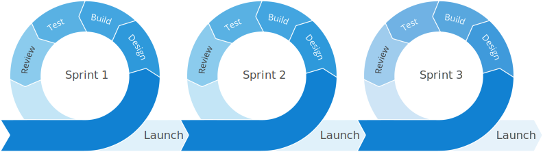

# Agile
The Agile mindset is focused on collaboration and the ability to adapt to change quickly while focusing on delivering value to the customer. Agile utilizes an iterative approach that allows teams to respond to changing priorities and customer needs by working in small incriments.

>Users don't know what they want until they see working software. - Humphrey's Law

## Software delivery lifecycle
Traditionally, software development would endure long release cycles under a siloed process. In iterative delivery, these phases are reduced to smaller cycles with increased feedback loops.

SDLC tools are used to manage this work from a large portfolio level down to the team and individual level using tickets and boards with powerful integrations across the toolchain.

## Agile frameworks
Within Agile, there are many different frameworks, each approaching work, team composition, and cadence differently. The most popuar are Kanban and Scrum, each approaching work and cadence separately with a similar goal of swarming, iterating, and collaborating.