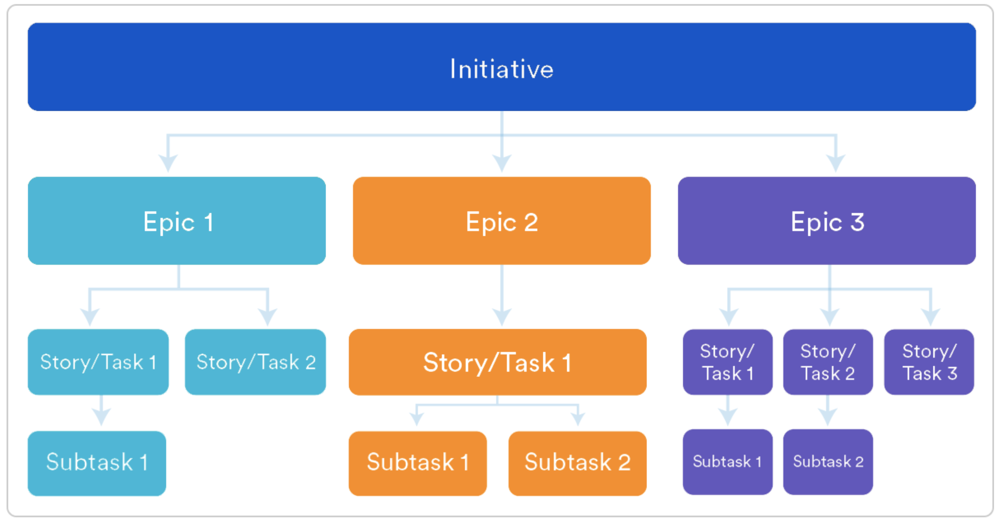

# Jira

Jira is a ticketing system that allows teams to manage and share the status of work as well as a mechanism to prioritize that work. This helps create transparency into all work executed by a delivery team, resulting in:
- A single point of truth for all work done by a team
- No hidden or untracked work
- High alignment and updates between team members on the work in progress
- Ownership of all the work by the team
- Allows leaders to see what is happening without distracting team members

### Features

- **Backlog.** Prioritized list of tickets to be reviewed, refined, and readied to bring into the sprint.
- **Kanban Boards.** Single pane of glass for current work in progress.
- **Ticket Status.** Provide real-time conversation and associated commits and build history with each ticket, along with ongoing comments and status updates.

As you can see above, there are 4 stages that a ticket, or a task, can be in:
- To Do
- In Progress
- To Demo(Review)
- Done

As a team member moves the task from stage to stage, he or she can alter settings to notify their team, or comment on events that have taken place pertaining to his or her ticket. It is crucial to constantly be updating and commenting on your tickets; the transparency to your teammates will keep everything running more smoothly.

### Breakdown of Ticket Types

Jira refers to tickets as *issues.* Although there are various ticket types out of the box (include customizations), a lean DevOps team will focus on these tickets:

| Ticket | Purpose | Duration |
| --- | --- | --- |
| **Epic** | Large bodies of work, feature focused or higher, spans multiple Sprints | 1-4 iterations |
| **Story** | Small amount of work, driven by the Product Owner | 1 day |
| **Subtask** | Small amount of work (often created in-sprint) that lives under a story or task | <1 day |

# Epic Recommended Fields
| Issue Type | Recommended Field | Purpose | 
| --- | --- | --- |
| **Epic** | Project | Pick the relevant project (one team can work on multiple projects)s |
| **Epic** | Summary | High level description of Epic |
| **Epic** | Assignee | Individual initially accountable for Epic’s completion |
| **Epic** | Labels | Can be used to specify the team and other activities tags |
| **Epic** | Description | Detailed information about the Epic |
| **Epic** | Attachment | Attach files or documents that are relevant to the Epic |
| **Epic** | Fix Version/s| Version and Release this Epic is planned for |

# Story Recommended Fields
| Issue Type | Recommended Field | Purpose | 
| --- | --- | --- |
| **Story** | Summary | High level description of Story|
| **Story** | Assignee | Individual initially accountable for Story completion |
| **Story**| Labels | Can be used to specify the team and other activities tags |
| **Story**| Flag | Is this work currently blocked by another issue? |
| **Story** | Description | Detailed information about the Story |
**Story** | Story Points | Relative Scale: 1, 2, 3, 5, 8, 13, 21 |
| **Story**| Sprint | Anticipated Sprint this user Story will be completed in |
| **Story**| Linked Issues | Stories that must be completed prior, concurrent or after this story|
| **Story**| Attachment | Attach files or documents that are relevant to the Story|
| **Story** | Fix Version/s| Version and Release this Story is planned for |

# Subtask Recommended Fields
| Issue Type | Recommended Field | Purpose | 
| --- | --- | --- |
| **Subtask** | Summary | High level description of Task or Subtask|
| **Subtask** | Assignee | Individual initially accountable for Task or Subtask completion |
| **Subtask** | Flag | Is this work currently blocked by another issue? |
| **Subtask** | Description | Detailed information about the Story |
| **Subtask** | Sprint | Anticipated Sprint this user Story will be completed in |
| **Subtask** | Linked Issues | Tasks or Subtasks that must be completed prior, concurrent or after this story|
| **Subtask** | Attachment | Attach files or documents that are relevant to the Story|
| **Subtask** | Fix Version/s| Version and Release this Task is planned for |

## Creating Effective Jira Tickets

### Styling
 - Every part of a ticket should be visually appealing to ensure readability
 - Use syntax, grammar, capitalization, punctuation to your advantage
 - Make things as simple and direct as possible
 - Use proper formatting and make use of special insert options 
   - "Info" can be used for warnings such as version dependencies
   - User mentions (@name) should be used when possible
 - Use screenshots effectively
   - Captions should be properly labeled, not "Screen Shot 2019-02-25 at 2.07.34 PM"

### Content

 - Make sure the each ticket has [Acceptance Criteria](3/agile_stories.md)
 - A Definition of Done (DOD) should be located in the summary of the ticket
 - The summary should be updated with any relevant links
 - Solutions should be easily repeatable by anyone
 - Cite tickets in GitHub commits to have them referenced within the ticket automatically
   - Commit message format: <ticket> <commit message>
   - Example: THEIA-107 updated /theia directory path for easier buildability

## Deliverable

Discuss and understand how to create & maintain effective tickets and the Scrum & Kanban framework. 
