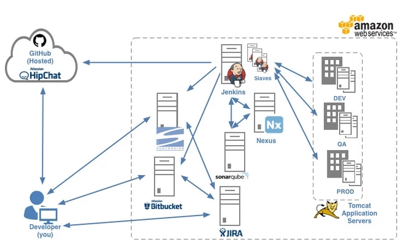
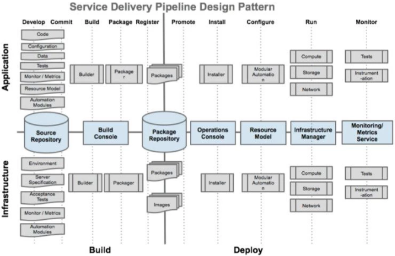

# 5.1 DevOps Tools

Build: The process of compiling or packaging a code repository into a deployable artifact; running tests that are embedded in the code as a part of the packaging process & then push the artifact to a staging repository/location aka Nexus artifact repository.

Deploy: The process of taking a built artifact from a staging location & pushing to a target node/server & triggering downstream tests.

## Becoming a Successful DevOps Engineer

Understanding the functions of Software Delivery entirely & all of the tools that make up that pipeline is critical. The following are the high-level reasons to master the tools:

1. Understand
2. Build
3. Maintain
4. Solve

  

## Features of Tools Administration
1. Identifying the right functional areas that need to be solved
2. Identifying the right tools
3. Evaluating and POC'ing the right tools
	a. Current State
	b. Future State
	c. Gaps
	d. Market Scan
	e. Industry Trends
	f. POC
	g. Adoption
4. Role of Tools in Enterprises vis-a-vis Process
5. Philosophy Around Tools

  

 	 a. Service Quadrant
  	 b. Right tools for right needs
  	 c. Plug & Play Tools

## What to take away from this

#### Tool Role Understanding
Understand what the tools do but more importantly the part they fulfill in a CI/CD pipeline. One image on this page is a Design Pattern and you'll notice there is no tool specified. This is because we should be easily able to add and remove specific tools as long as the function is maintained.

#### Tool Technical Skill
As awesome as understanding the role is there is something about getting lost in the tech that is both fun and educational. You should have a better understanding of Unix and tool administration. Tools vary but many of the methods for installing, maintaining, and removing software are similar across multiple tools.

#### Problem Solving
The understanding of the tools, both theoretical and practical, will help you to solve many of the problems you encounter in our field. Understanding the theory will help you to architect solutions as well as in the field and the skillset acquired using the tools will allow you to execute the architected solution.

#### Talking through your solutions
When working through this make sure to demo frequently, talk to your peers, and talk properly to the tools. Make sure terminology is correct and that you work on easily explain what is happening. Remember "You do not really understand something unless you can explain it to your grandmother". In consulting we will deal with people who do not have the same skillset as us so matching levels of understanding will be beneficial.

##### These combined skills allow you to execute like an elite operator.
