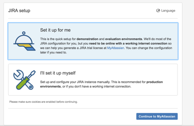
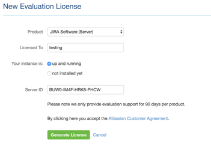
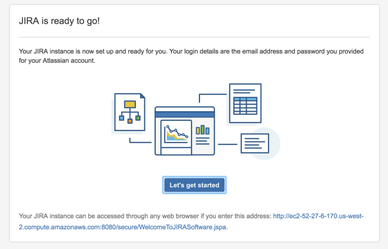
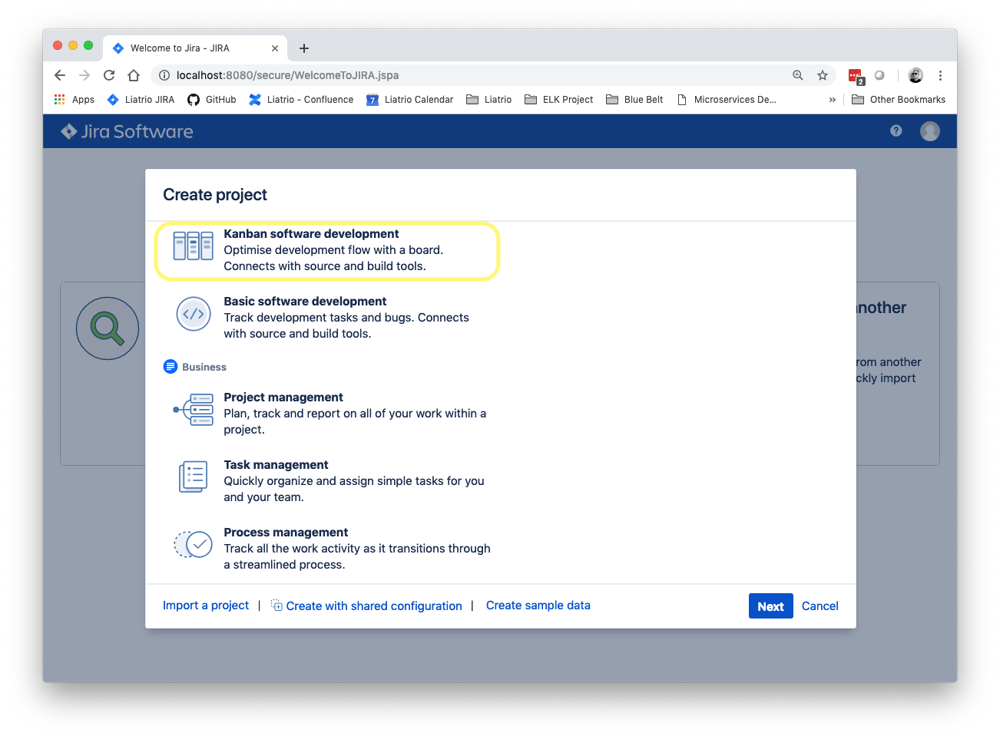
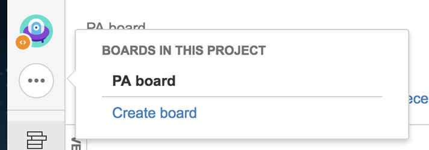
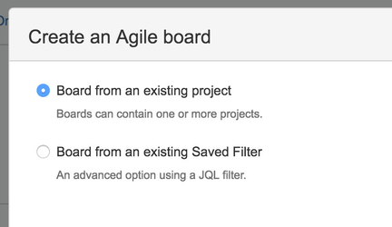
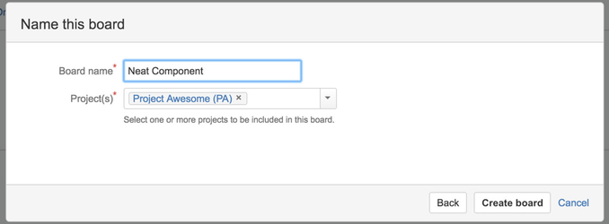
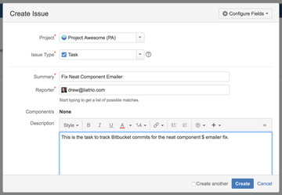

# Jira
  
1. Create a new instance in AWS. Name it in the form yourname-jira. Be sure to note the instance-id and public DNS.
2. Ensure your Security Group has port TCP/8080 open on AWS.
3. ssh to your instance
4. Update your system with yum and install OpenJDK 8 ( java-1.8.0-openjdk.x86_64 ).
5. Set the default version of java to OpenJDK 8.

```
$ sudo /usr/sbin/alternatives --config java
```
6. Create a swap partition
7. Download [Jira Software](https://www.atlassian.com/software/jira/download) - use Linux 64 Bit Download.
8. Transfer the atlassian-jira-software-7.1.8-jira-7.1.8-x64.bin file from the previous step to your instance. E.x. using scp:
```
 $ scp -i ~/Desktop/liatrio-20160425.pem atlassian-jira-software-7.1.8-jira-7.1.8-x64.bin ec2-user@ec2-52-27-6-170.us-west-2.compute.amazonaws.com:/home/ec2-user
```
9. Change the atlassian-jira-software-7.1.8-jira-7.1.8-x64.bin to be executable:
```
$ chmod 755 atlassian-jira-software-7.1.8-jira-7.1.8-x64.bin
```
10. Run the installer with the following options:
```
$ sudo ./atlassian-jira-software-7.1.8-jira-7.1.8-x64.bin
```
11. Browse to http://instance_public_dns:8080/ and choose "Set it up for me"

<center>

   

</center>

12. Configure the evaluation license. This might be cached if you have recently configured a trial Bitbucket.

<center>

   

</center>

13. Wait for install to complete

<center>

   

</center>

14. Create a new Project. Naming it is your choice, in this example "Project Awesome" was used.

<center>

   

</center>

15. Hover over the elipse in the upper left pane and click "Create Board"

<center>

   

</center>

16. Click "Create a Kanban Board"

<center>

   

</center>

17. Choose "Board from an existing project" and click next

<center>

   

</center>

18. Name your board. Think of this as a subset of your project. In this scenario, I have project awesome with a kanban board to manage my "Neat Component"

<center>

   

</center>

19. Create a JIRA ticket on your Kanban board

<center>

   

</center>

20. Follow the steps [here](https://confluence.atlassian.com/bitbucketserver/linking-bitbucket-server-with-jira-776640408.html) to integrate JIRA with Bitbucket Server. The goal will be make a commit to Bitbucket automatically link back to the ticket you created in the previous step.

## Connect Jira to your pipeline

- Create a "spring-petclinic" project in Jira
- Hook up jenkins so that code commits with specific JIRA ticket numbers hyperlink to Jira
- Install Visualisation of Jenkins Builds in Jira
    - https://marketplace.atlassian.com/plugins/com.marvelution.jira.plugins.jenkins/server/overview
- Give liatrio team members access to Jira
- Assign accounts to allow edit/creation of tickets in the spring-petclinic project
- Create a Hygieia project in Jira
- Give liatrio team members Admin-level access to the Hygieia project
- Create a kanban board that combines Hygieia and spring-petclinic projects

