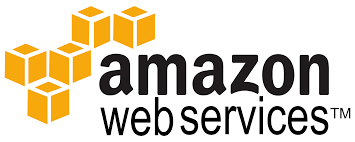

<center>

   

</center>

Amazon provides a wide variety of cloud based web services (usually referred to simply as AWS). In the next few sections we will demonstrate use cases for several different AWS services.

# Accounts and billing

The cost of using AWS services often depends on several different factors. For example the cost of running an EC2 instance to host Jenkins would depend on the instance tier, amount of CPU time used and the amount and type of storage. Tier levels generally affect peak performance such the amount of available CPU processing and memory or type of storage. The general rule is you pay for what you use.

Amazon provides many free tier, trials and low cost solutions which are helpful for experimenting with new solutions (like the exercises in this bootcamp :) but care should be taken to avoid running up unnecessary bills. If you are a Liatrio apprentice talk to you team lead to setup access our AWS accounts otherwise you can [create an account](https://portal.aws.amazon.com/billing/signup) to complete the exercises in this section.

## Tips for keeping costs low

- Use low cost resources, such as t2.micro EC2 instances and EBS storage unless you know you need more performance or memory.
- Stop resources such as EC2 instances when not in use. For example if you are using an instance for testing stop it at the end of the day or when you are working on something else.
- Terminate instances and delete associated resources (storage volumes, Elastic IP's, Route53 domain names, etc). Tags (see below) are a good to group resources together to make them easy to find and clean up.

# Organizing resources

## Tags

> Amazon Web Services (AWS) allows customers to assign metadata to their AWS resources in the form of tags. Each tag is a simple label consisting of a customer-defined key and an optional value that can make it easier to manage, search for, and filter resources. [AWS Tagging Strategies](https://aws.amazon.com/answers/account-management/aws-tagging-strategies/)

Tags provide a flexible way to manage resources. They can provide information about their intended use, how they were created, who is responsible for them, their expected lifetime or anything else. This is especially important for organizations where resources are created and managed by different people or other tools. In order for them to be effective they should consistent. Having an organization wide policy and enforcement for tagging resources can be indispensable.

### Liatrio's Tagging Standards

**Cost Accounting Tags**
- Client: Name of the client
- Project: Specific initiative or project name (Security Swat, Demo Pipeline, etc)

**General Information Tags**
- Environment: Demo, Test, Production
- Application: Descriptive name such as HipChat, Jenkins, etc
- Owner: Humanly readable username ie Slack handle
- Automation Candidate: - Yes, No. Used for automation to auto-terminate services and instances that are not meant to be persistent

## Names

Resources names in AWS are actually just tags with the label *Name*. Names should easily identify the owner and purpose of the resource and be concise while differentiating it from other resources. As a general naming convention we recommend something like **OWNER_NAME-TOOL-NAME** which would give you something like **matt-jenkins-master**.

# Console vs CLI

Once your are signed in to AWS you can use the web based [console](https://console.aws.amazon.com/) to create and manage resources. The console is great for monitoring, troubleshooting problems and making quick changes. Amazon also provides an AWS CLI tool which is indispensable for creating repeatable / documentable steps, automating processes and text only environments. The exercises in this chapter will focus on using the command line tool but both provide the same functionality.

## CLI Setup

**Requirements**
- Python 2 version 2.6.5+ or Python 3 version 3.3

**Note:** aws-vault is not necessary to use the AWS CLI but adds addition security by storing your credentials in a more secure way.

1. If you do not already have security credentials for you account open [My security credentials](https://console.aws.amazon.com/iam/home?#/security_credentials) in the AWS console; click *Create access key* and download the csv file or save your credentials someplace safe.
2. Install the [awscli](https://aws.amazon.com/cli/) tool: `pip install awscli`
3. Install [aws-vault](https://github.com/99designs/aws-vault): `brew cask install aws-vault`
4. Add your credentials to aws-vault by running `aws-vault add PROFILE_NAME`. **Note:** replace *PROFILE_NAME* with whatever you would like to call your profile. You will be prompted to enter your AWS credentials and then to create a password to protect them.
5. Test AWS CLI `aws-vault exec PROFILE_NAME -- aws s3 ls`

If this is a new account the output from the last command will be empty but you wont see any errors. The command uses *aws-vault* to execute *aws s3 ls* using the credentials for your profile. *aws s3 ls* lists the s3 buckets you account has access to in your default region.

## Exercise

###### Through these steps you will build two servers on AWS, one as a Jenkins master and the other a Jenkins agent.

1. Create a key pair in AWS.
2. Install awscli tool:`$ pip install awscli`

3. Setup awscli. Ask someone to create you an AWS account. Fill in the prompts:

```
$ aws configure
    Access Key:
    Secret Key:
    Default region: us-west-2
    Default output: <leave blank, hit enter>
```

4. Create a Jenkins master instance. **Write down the instance ID:**

```
$ aws ec2 run-instances --image-id ami-d0f506b0 --count 1 --instance-type t2.micro --key-name liatrio-2016.04.25 --security-groups jenkins | grep InstanceId
```

5. Name your server, replace i-xxxxxxxxxxxxxxxxxxx with your instance ID and replace Justin with your name in lower case:

```
$ aws ec2 create-tags --resources i-xxxxxxxxxxxxxxxxxxx --tags "Key=Name,Value=justin-jenkins-master"
```


6. Find and **write down** the hosts public DNS name. Replace i-xxxxxxxxxxxxxxxxxxx with your instance ID:

```
aws ec2 describe-instances --instance-id i-xxxxxxxxxxxxxxxxxxx | grep PublicDnsName | head -1
```

7. Login to your host. The default username is ec2-user and you will have to use your private key:

```
$ ssh -i liatrio-20160425.pem -l ec2-user ec2-52-36-229-73.us-west-2.compute.amazonaws.com
```

8. Use yum to update your system
9. Use yum to install openjdk-1.8.0, wget, and git
  - Be sure to update your default Java version to avoid a _jenkins dead but pid file exists_ error using:
    - ```sudo alternatives --config java```

10. Install Jenkins. Follow this guide from [CloudBees](https://wiki.jenkins-ci.org/display/JENKINS/Installing+Jenkins+on+Red+Hat+distributions)
11. Browse to your Jenkins instance and setup security immediately! The internet can be a dangerous place as an open Jenkins can be used to run arbitrary commands. (This may no longer be necessary).

- Create an admin user
   - Manage Jenkins > Manage Users > Create user
- Disable anonymous access and grant all access to the admin user:
   - Check Enable Security
   - Access Control > Security Realm > Choose “ Jenkins’ own user database” and uncheck “Allow users to sign up”
   - Access Control > Matrix-based security > Ensure anonymous is fully unchecked and admin is fully checked (to the very right there is a button to check / uncheck all)
     - Manage Jenkins > Configure Global Security

12. To stop your instance at the end of the day:
```
$ aws ec2 stop-instances --instance-ids i-xxxxxxxxxxxxxxxxxxx
```

13. To start up your instance the next day:
```
$ aws ec2 start-instances --instance-ids i-xxxxxxxxxxxxxxxxxxx
```

14. The DNS name is not persistent through shutdown and start. Run step 6 again to get the hostname of your instance.
15. Note we'll need to clean things up by the end of the week as running instances and their storage cost money.

**To permanently destroy and delete your instance:**

```
$ aws ec2 terminate-instances --instance-ids i-xxxxxxxxxxxxxxxxxxx
```
### Create a jenkins agent instance (open ended exercise):

1. Create an instance based on the previous steps and name it yourname-jenkins-agent. Do not install jenkins on the agent however. To use this system as a agent, google for steps. I found these links useful:
   - https://gist.github.com/mgedmin/9547214
   - https://www.caktusgroup.com/blog/2012/01/10/configuring-jenkins-slave/
2. As a high level over view you will need to create a private ssh key for the jenkins user on the jenkins master. A jenkins user will need to be created on the agent and the public key from the jenkins master will need to be added to the authorized keys so the jenkins master can ssh to the jenkins agent and tell it to execute jobs and commands.

## Deliverable

1. Know AWS through the command line.
2. Run multiple application deploys.
