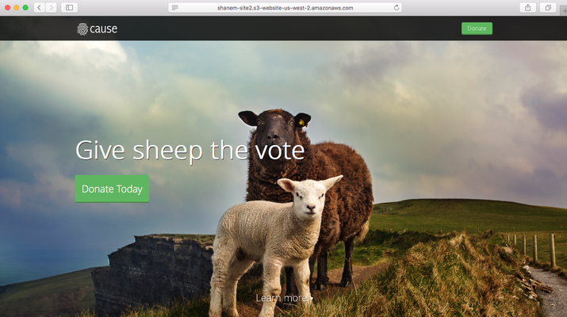

# S3 

## Create a Website Repository

>Feeling Creative? Substitute the example template with your own idea.

1. Create a new GitHub public repository, <your-name>-site.
2. Clone the repository locally.
3. CD into the cloned repository.
4. Download this ZIP file and unzip the contents into your new repository.[ZIP File](https://github.com/CloudCannon/cause-jekyll-template/archive/master.zip)
5. Run the following commands to initialize the website.

>These commands required Ruby to be installed. Install Ruby with [RVM](https://rvm.io/).

`bundle install`
`bundle exec jekyll serve`

6. Navigate to http://localhost:4000 to confirm that the website is running locally.
7. Commit your changes to Git.

## Create an S3 Bucket and Configure it for Website Hosting

>These commands use the [AWS CLI](https://aws.amazon.com/cli/) and require AWS credentials to be properly configured for use by the CLI.

### Create the Bucket Itself

This command creates an S3 bucket. Replace shanem-site with <your-name>-site. The region requires a location constraint be specified because it is not in us-east-1.

`aws s3api create-bucket --bucket shanem-site2 --create-bucket-configuration LocationConstraint=us-west-2`

### Configure the Bucket for Static Website Hosting

Again, replace shanem-site with your bucket's name. This command specifies the bucket as one that hosts static website content as well as specifies which files to be used for the home page and error page.

`aws s3 website s3://shanem-site/ --index-document index.html --error-document 404.html`

### Tag the Bucket

Add the Project tag to this bucket. Project is a [cost allocation](http://docs.aws.amazon.com/awsaccountbilling/latest/aboutv2/cost-alloc-tags.html) enabled tag. Be sure to replace shanem-site with your bucket's name.

## Upload your Site to S3

Navigate to the directory of your repository that contains _site and run the following command to synchronize that folder's contents with your S3 bucket. Again, replace shanem-site with your bucket's name. The ACL flag specifies that this content will be readable by the public, which allows people visiting the website to view it.

`aws s3 sync _site s3://shanem-site --acl public-read`

Navigate to http://<your-bucket-name>.s3-website-us-west-2.amazonaws.com to confirm that all steps were followed properly.

<center>

  

</center>

## Cleanup

The following commands delete all objects in the bucket and remove the bucket.

>These commands are dangerous! Make sure you actually want to delete, and double check your syntax.

> Do not delete your resources if you plan on continuing to 6.4 CloudFront & Route 53, as they will be reused.

Be sure to replace shanem-site with your bucket's name.

```
# Remove All Objects

aws s3 rm s3://shanem-site --recursive

# Delete the Empty Bucke`

aws s3api delete-bucket --bucket shanem-site
```


