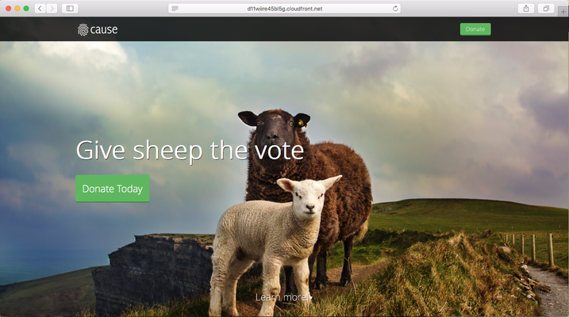
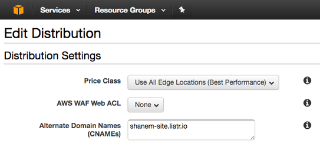
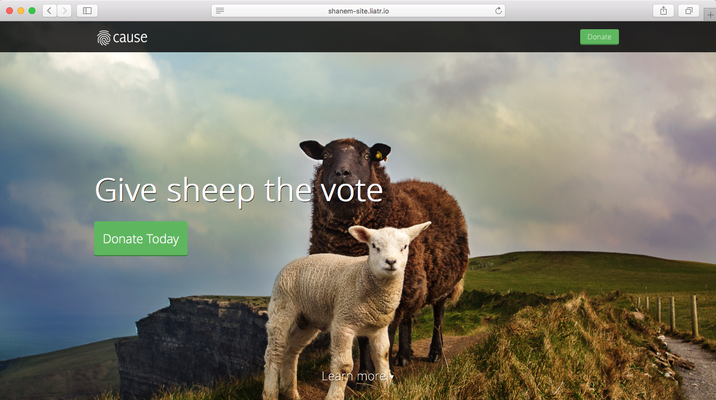

# CloudFront & Route 53

> #### **Introduction**
Amazon CloudFront is a web service that speeds up distribution of your static and dynamic web content, for example, .html, .css, .php, image, and media files, to end users. CloudFront delivers your content through a worldwide network of edge locations. When an end user requests content that you're serving with CloudFront, the user is routed to the edge location that provides the lowest latency, so content is delivered with the best possible performance. If the content is already in that edge location, CloudFront delivers it immediately. If the content is not currently in that edge location, CloudFront retrieves it from an Amazon S3 bucket or an HTTP server (for example, a web server) that you have identified as the source for the definitive version of your content.
 --- [AWS Docs on CloudFront](https://docs.aws.amazon.com/cloudfront/index.html#lang/en_us)


## About
This exercise will enable a Web Distribution using CloudFront for the S3 website deployed in [6.3 S3](https://devops-bootcamp.liatr.io/#/6/6.3-s3), and create an alias Record Set to forward traffic from a subdomain using liatr.io.

## Enable CloudFront in AWS CLI

The AWS CLI, as of version 1.11.82, does not allow CloudFront commands to be executed by default because it is a newer feature. To enable CloudFront commands, run the following command to append to your configuration file.

```
aws configure set preview.cloudfront true
```

## Create a Web Distribution for your S3 Website
#### Create the Distribution

This command specifies what URL and root object to use as the origin for the web distribution. The last part of the command limits the output to the URL assigned to the newly created distribution. Alternatively, omit the grep and then take note of the created distribution's ARN, Domain Name, and ID. The ARN can be used to add tags, the domain name is where you can reach your distribution on the web, and the ID is used to delete the distribution.

```
aws cloudfront create-distribution \
--origin-domain-name shanem-site2.s3-website-us-west-2.amazonaws.com \
--default-root-object index.html | grep "DomainName"
```

#### View the Results
Navigate to the outputted CloudFront URL to view your S3 content now distributed using a Web Distribution. This enables your S3 content to be accessible as fast as possible for users.

<center>

  Example URL: http://d11wiire45bl5g.cloudfront.net

  

</center>

#### Tag your Distribution

Run this command to list distributions and grep for ARN's. The resource ARN is needed to tag distributions.

```
aws cloudfront list-distributions | grep ARN
```

If you are unsure if the ARN is correct, you can verify it within the AWS Console. Run the following command using your distribution's ARN to tag it appropriately.

```
aws cloudfront tag-resource --resource arn:aws:cloudfront::880678759810:distribution/E36HO1XQZB7IZ4 --tags 'Items=[{Key=Project,Value=DOB}]'
```

## Forward a Subdomain

#### Add the Alternate Domain Name

Navigate to CloudFront within the AWS Console and edit your Web Distribution. Add an alternate domain name as picture in Figure 1. Save.

<center>

  

  Figure 1

  

  Figure 2

</center>

#### Create a Record Set

Navigate to [Route 53](https://console.aws.amazon.com/route53/) → Hosted Zones → liatr.io → Create Record Set. Create settings similar to those pictured in Figure 2 and click Create.

## View the Results

After waiting for your Web Distribution to update with the alternate domain name, your site should now be viewable at [your-name]-site.liatr.io! Congratulations!

<center>

  

</center>

### Summary

In conclusion, your content should now be reachable from three locations.

 - http://shanem-site2.s3-website-us-west-2.amazonaws.com/
 - http://d11wiire45bl5g.cloudfront.net/
 - http://shanem-site.liatr.io/

Your content has progressed from a GitHub repository to S3, to a CloudFront Web Distribution, to a Route 53 subdomain Record Set alias.

## Cleanup

>These commands are dangerous! Make sure you actually want to delete, and double check your syntax.

### Delete the distribution using its ID.
```
aws cloudfront delete-distribution --id E2FVJBYEXZ1PAK
```
Delete the created Record Set by navigating to it in the AWS Route 53 Console.


