# Auto Scaling

## Milestones for this Section
1. Understand how User Data can be utilized to provision instances
2. Implement EC2 User Data using the AWS CLI
3. Load Balance traffic between two instances
4. Create a Launch Configuration to replace steps one and two
5. Create an Auto Scaling Group using the Launch Configuration from step four
     - Associate the Auto Scaling Group with the Load Balancer from step three
     - Reference the Load Balancer's health checks with the Auto Scaling Group

## 1. EC2 & User Data

> ### Milestone One - Understand how User Data can be utilized to provision instances
Understand the example User Data script. Ask your DOB Leader if you do not understand any portion of the example script.
Discuss as a group possible uses for User Data. Keep in mind the scope can be large or small.
As a group, decide what type of script you would like to create and work with for this exercise. There are bonus points if the application displays what instance it is being hosted on via [instance metadata](https://docs.aws.amazon.com/AWSEC2/latest/UserGuide/ec2-instance-metadata.html#instancedata-data-retrieval). Possible ideas are your application from Section 2, a simple website that displays the instance metadata, or any open source project that is simple to spin up. Be sure that the application is easy to work with.
Create the script, and test it to make sure it accomplishes what you set out to do.

#### 1. Start Scripts

Below is an example of a script that installs and configures Tomcat 8 on an EC2 instance running the Amazon Linux AMI.

- Installs Tomcat 8 and configures it to start on reboot
- Builds Spring-Petclinic and adds it to Tomcat 8
- Allows Spring-Petclinic to be visible at http://<public-ip>/petclinic

#### 2. Basic Idea

EC2 instances can be configured using the User Data option, which runs commands when a new instance is launched. User Data can accomplish anything that shell commands can.

>Read this [section](https://docs.aws.amazon.com/AWSEC2/latest/UserGuide/ec2-instance-metadata.html#instancedata-add-user-data) of the AWS documentation to learn more.

User Data can be specified when launching an EC2 instances via the AWS Console, as pictured below, or via the AWS CLI by utilizing the --user-data flag. A common method used is to store scripts on S3 and utilize them with the --user-data flag.

After this is accomplished, a Classic Load Balancer will be configured with an Auto Scaling group for the instances.

<center>

  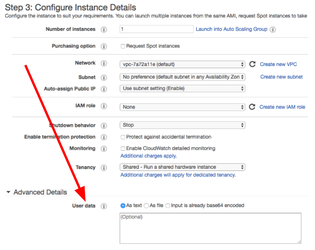

</center>

> ### Milestone One - Deliverables
- Your group's User Data script
- Demonstrate your script configuring an instance
- Navigate to the application running within a browser
- After the demo, terminate any instances created up until this point

> ### Milestone Two - Implement EC2 User Data using the AWS CLI
- Understand the example AWS CLI command above. Ask your DOB Leader if you do not understand any of the flags.
- Discuss as a group the benefits of using the AWS CLI over manually configuring resources via the AWS Console.
- Utilize the AWS CLI to spin up two instances in total using your User Data

#### 3. Starting Two Instances Using the Tomcat 8 Startup Script as User Data via AWS CLI

Use the commands below as an example. Do not simply copy and paste it. Understand what each flag does, and make sure it does what you want. It's suggested to make a custom security group via the AWS EC2 console for your application. Your User Data script can be stored locally or elsewhere.

> S3 is a good place to store User Data scripts.

**Creating Two Instances using User Data:**
```
$ mv ~/Downloads/installConfigureTomcat8.sh .
$ aws ec2 run-instances --image-id ami-d0f506b0 --count 1 --instance-type t2.micro --key-name liatrio-2016.04.25 --security-groups jenkins --tag-specifications 'ResourceType=instance,Tags=[{Key=Project,Value=DOB},{Key=Name,Value=<YOUR-DOB-GROUP-NAME>-<APPLICATION-NAME>-auto1}]' --user-data file://installConfigureTomcat8.sh | grep InstanceId > tmpInstance1IDName.txt
$ aws ec2 run-instances --image-id ami-d0f506b0 --count 1 --instance-type t2.micro --key-name liatrio-2016.04.25 --security-groups jenkins --tag-specifications 'ResourceType=instance,Tags=[{Key=Project,Value=DOB},{Key=Name,Value=<YOUR-DOB-GROUP-NAME>-<APPLICATION-NAME>-auto2}]' --user-data file://installConfigureTomcat8.sh | grep InstanceId > tmpInstance2IDName.txt
```
> ### Milestone Two Deliverable
- Two EC2 instances spun up using User Data and the AWS CLI

## 2. Classic Load Balancers

> ### Milestone Three - Load Balance traffic between two instances
- Discuss as a group the benefits of load balancing traffic.
- Follow the steps above to create a Classic Load Balancer for your two instances from Milestone Two.
- Be sure to configure your Load Balancer with respect to your application choice.

Below are instructions for setting up a Classic Load Balancer for the two instances created in Milestone Two. Apply these instructions to your application. Keep in mind that these instructions were created for Tomcat 8 running Spring-Petclinic. Make necessary changes for your situation.

1. Navigate to the Amazon EC2 [console](https://us-west-2.console.aws.amazon.com/ec2/v2/home?region=us-west-2#LoadBalancers:).
2. Click Create Load Balancer.
3. Specify Classic Load Balancer and click Continue.
4. Specify a name, such as <your-name>-load-balancer.
5. Add TCP port forwarding on port 8080, because that's what Tomcat 8 will be running on (assuming the default port was not modified, see comments in script).
6. See Figure 1 below.
7. Specify the same security group as the instances have; in this case, jenkins.
8. When configuring the health check settings, specify port 8080 instead of 80. Specify the path of /petclinic as opposed to /index.html. Specify the protocol as TCP. These steps are important to ensure that the load balancer is properly setting the instances' healths.
9. Continuing the health check settings, make sure to set the Timeout to 5 seconds, the Interval to 100 seconds, the Unhealthy threshold to 10, and the Healthy threshold to 4. Hover over the question marks to see explanations.
10. When specifying instances to use, make sure to check the ones created in step 1.3 above.
11. See Figure 2 below.
12. When specifying Tags, make sure to add the Project tag. In this case, the project is DOB.
13. Review the settings at the end and create the Classic Load Balancer.
14. See Figure 3 below.
15. Navigate to your Load Balancer in the list within the EC2 Console, and confirm that your instances are being load balanced and are healthy.
16. See Figure 4 below.
17. If your Load Balancer is reflective of Figure 4, with the instances labeled as InService, congratulations! You have now load balanced two automatically configured EC2 instances using User Data.

> #### Security Groups should have only the minimum access required for your application.

<center>

Figure 1:

  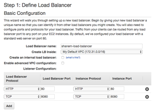

Figure 2:

  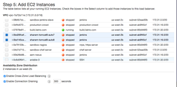

Figure 3:

  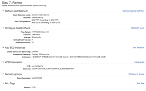

Figure 4:

  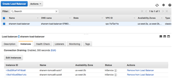

</center>

> ### Milestone Three Deliverables
- Your group's two instances' traffic being load balanced by a Classic Load Balancer as visible from the AWS Console
- Demo your Load Balancer's settings including Description, Instances, Health Check, Listeners, Monitoring, and Tags

## 3. Launch Configurations

<center>

  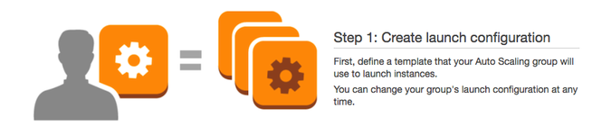

</center>

> ### Milestone Four - Create a Launch Configuration
- Discuss as a group the benefits of using Launch Configurations.
- Follow the steps above to create a Launch Configuration utilizing your User Data.

Below are instructions for setting up a Launch Configuration. Apply these instructions to your application. Keep in mind that these instructions were created for Tomcat 8 running Spring-Petclinic. Make necessary changes for your situation.

1. Navigate to the Amazon EC2 [console](https://us-west-2.console.aws.amazon.com/ec2/v2/home?region=us-west-2#LoadBalancers:).
2. Under Auto Scaling, click Launch Configurations.
3. Click Create Auto Scaling Group.
4. Continue to Create Launch Configuration.
5. Select the Amazon Linux AMI.
6. Name the Launch Configuration <YOUR-NAME>-launch-config.
7. On the Configure Details step, show advanced options.
8. Copy and paste the startup script from step 1 into this box.
9. See Figure 1 below.
10. Specify the jenkins security group.
11. You should now be automatically redirected to Create Auto Scaling Group. Navigate to Auto Scaling Groups if you did not get automatically redirected and proceed to step 4.

<center>

Figure 1:

  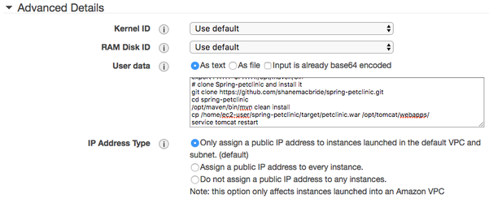

</center>

> ### Milestone Four Deliverables
- Ensure that your Launch Configuration is configured correctly.

## 4. Auto Scaling Groups

<center>

  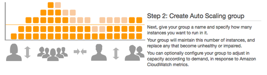

</center>

> ## Milestone Five
- Create an Auto Scaling Group using the Launch Configuration
- Associate the Auto Scaling Group with the Load Balancer
- Reference the Load Balancer's health checks with the Auto Scaling Group
- Discuss as a group the benefits of using an Auto Scaling Group.
   - use cases of an Auto Scaling Group of different sizes
   - with and without Load Balancers
   - using EC2 Health Checks vs. Load Balancing Health Checks
   - groups of size one
   - pricing

Below are instructions for setting up an Auto Scaling Group. Apply these instructions to your application. Keep in mind that these instructions were created for Tomcat 8 running Spring-Petclinic. Make necessary changes for your situation.

1. Navigate to the Amazon EC2 [console](https://us-west-2.console.aws.amazon.com/ec2/v2/home?region=us-west-2#LoadBalancers:) and select Auto Scaling Groups if not automatically redirected already.
2. For the group name, name it <your-name>-auto-scaling-group.
3. Specify to start with 2 instances.
4. Specify us-west-2b for the subnet, as this is where the instances in the ELB are located. For real scenarios, it is suggested to use more than one subnet to provide fault tolerance.
5. See Figure 1, a screenshot taken from the Load Balancer settings specifying which subnet the instances are located in.
6. Under Advanced Details, check the box for Receive Traffic from One or More Load Balancers.
7. Specify the Classic Load Balancer created in step 2.
8. Specify ELB for the Health Check type to reference the Health Check configuration made when the ELB was created.
9. Moving forward, confirm keeping this group at its initial size. This will make sure the group always stays at 2.
10. For real world scenarios, policies would be created to spin up a maximum number of instances using CloudWatch alarms.
11. Under Configure Tags, be sure to add Project and DOB, and Name with <your-name>-auto-scaling.
12. Review your settings and compare with Figure 2.
13. Continue to View Auto Scaling Groups and confirm your Auto Scaling Group is in service and has your original ELB instances reflected under Instances.

<center>

Figure 1:

  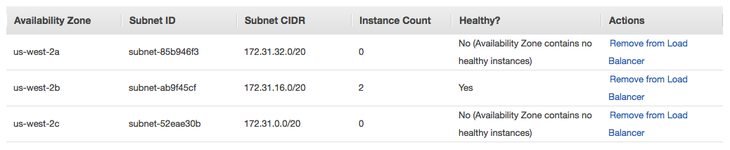

Figure 2:

  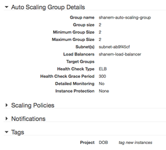

</center>

> ## Milestone Five Deliverables

<center>

  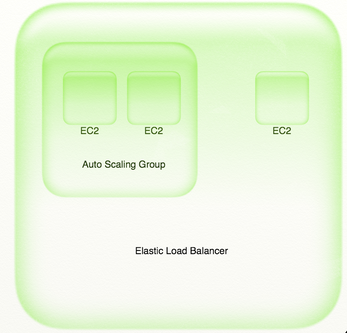

</center>

Navigate to the Load Balancer. Your original two instances belonging to the Load Balancer should be there along with two new instances that were spun up in accordance with the Auto Scaling group and your Launch Configuration.

<center>

  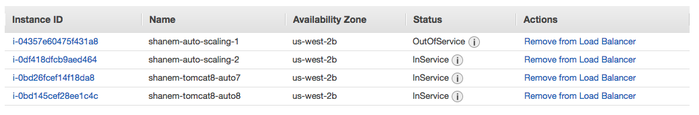

</center>

As you can see in the above image, the instances being spun up belonging to the Auto Scaling group are now attached to the Load Balancer. One is InService as it can be pinged according to our Load Balancer Health Check configuration at /petclinic on port 8080. The one that is OutOfService is currently installing Tomcat 8 and building Spring-petclinic.

<center>

  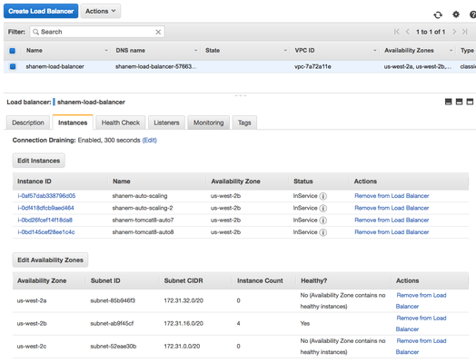

</center>

# Deliverable for Consultants
1. What is this tool?
2. How is it used in an enterprise?
3. Licensing costs
4. Liatrio's POV/uses for Load Balancers
5. Explain pros and cons
6. Create high level deck explaining Load Balancers. Coordinate with your team to also have a technical demo
7. Once an engineer has completed this exercise work with them to run through spinning up new instances
