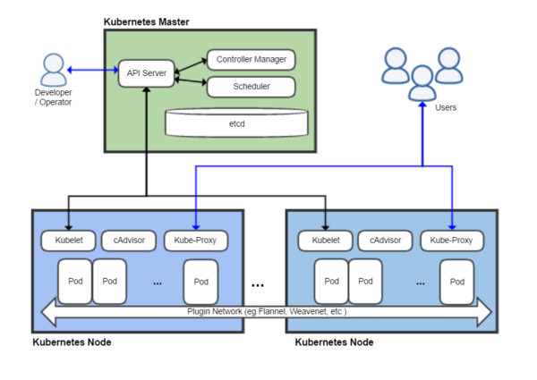

# EKS

In the previous section we managed conatiners using ECS. In this section we'll continue exploring container management, this time using EKS.

## Intro to Kubernetes

>Kubernetes is a portable, extensible open-source platform for managing containerized workloads and services, that facilitates both declarative configuration and automation. [Kubernetes](https://kubernetes.io/docs/concepts/overview/what-is-kubernetes/#what-kubernetes-and-k8s-mean)

| Resource | Description |
|----------|--------------------------------------------------------------------------------------------------------------------------------------------------------------------------------------------------------------------------------------------------------------------------------------------------------------------------------------------------------------------------------------------------------------------------------------------------------------------------------------------------------|
| Pods | The lowest point of organization for Kubernetes is the pod. A pod is a network wrapper around one or more containers though common practice is to use one container per pod. Pods have their own networking layer which allows communication between containers. |
| Nodes | A node is a worker machine in Kubernetes. A node may be a virtual or physical machine depending on the infrastructure. A node can contain a single pod or a collection of multiple pods. Nodes also have their own networking layer which makes pod communication across nodes possible. |
| Services | A service is a REST object similar to a pod that holds all of the networking information for each individual pod. This is because pods are often ephemeral and do not have a static IP address. This makes it so individual pods don't have to worry about the location of every other pod, they can simply route their traffic through a service. |
| Clusters | Clusters are the largest of the organizational structure of Kubernetes. A cluster can contain multiple nodes and has its own networking layer for communication between nodes. |

## Intro to EKS

Similar to ECS, Amazon's Elastic Container Service for Kubernetes (EKS) allows users to manage containers distributed amongst various AWS instances. However, where ECS is an Amazon specific container orchestration tool, EKS utilizes the popular container management platform Kubernetes to manage containers on AWS.

> Amazon Elastic Container Service for Kubernetes (Amazon EKS) is a managed service that makes it easy for you to run Kubernetes on AWS without needing to stand up or maintain your own Kubernetes control plane. Kubernetes is an open-source system for automating the deployment, scaling, and management of containerized applications. [Amazon EKS](https://docs.aws.amazon.com/eks/latest/userguide/what-is-eks.html)

Although AWS provides ECS as a container management tool, the popularity of Kubernetes spurred the creation of EKS. Before EKS, Kubernetes was commonly used in conjunction with AWS resources, so Amazon created EKS to make the integration between Kubernetes and AWS seamless. EKS runs the Kubernetes management infrastructure behind the scenes so that the user only has to worry about adding worker nodes to their cluster. Both vanilla Kubernetes and EKS use `kubectl` as a tool to interact with clusters, so experienced users of Kubernetes will find it easy to transition to EKS. 

## Kubernetes Control Plane

Kubernetes does a lot behind the scenes to manage and maintain various clusters. At the heart of Kubernetes cluster management is the control plane. Once you have set your desired state for your cluster, the control plane works to make sure that your cluster replicates and maintains this state. The control plane consists of a collection of processes including the **Kubernetes Master**, the **Kubelet**, and the **Kube-Proxy** all of which work to orchestrate communication and maintenance of all the resources that make up your cluster. 

- [Kubernetes Master](https://kubernetes.io/docs/concepts/)
  - The Kubernetes Master is a group of three processes that all run on a single node which is designated the master node.
  - The [kube-api server](https://kubernetes.io/docs/admin/kube-apiserver/), [kube-controller-manager](https://kubernetes.io/docs/admin/kube-controller-manager/), and the [kube-scheduler](https://kubernetes.io/docs/admin/kube-scheduler/) make up the processes on the master node
  - When you interact with Kubernetes via kubectl you're communicating with the cluster's master node.
- [Kubelet](https://kubernetes.io/docs/admin/kubelet/)
  - The agent that runs on every non-master node that makes sure each container is running properly inside a pod
  - The Kubelet is each node's communication endpoint with the Kubernetes Master 
- [Kube-Proxy](https://kubernetes.io/docs/admin/kube-proxy/)
  - The networking agent which runs on every non-master node and proxies UDP, TCP, SCTP
  - The Kube-Proxy also provides load balancing and is used to reach services

## Exercise 1

In the previous section we launch the SockShop demo on an ECS cluster to demonstrate deploying a microservice application. This exercise will have you deploy SockShop on EKS so you can explore the differences between the two services.

1. Create IAM roles to allow AWS to manage EKS services
  - You will need a role to allow EKS to manage clusters
  - You will need another role to allow EC2 instances to call EKS services(will need to refer to cloudformation script from AWS tutorial)
2. Install the `aws-iam-authenticator` following these [instructions](https://docs.aws.amazon.com/eks/latest/userguide/install-aws-iam-authenticator.html)
3. Create an EKS cluster
4. Connect your `kubectl` tool to your cluster
5. Create a Launch Configuration and Autoscaling group to launch Kubernetes EC2 images
6. Connect your EC2 instances to your cluster
7. Launch SockShop application on your cluster using the `complete-demo.yaml` in the [microservice-demo](https://github.com/liatrio/microservices-demo) repo

## Deliverables

- Discuss the differences between ECS and EKS
- Explain how services remedy the difficulties of ephemeral pods
- Describe the benefits/drawbacks of using EKS in enterprise
