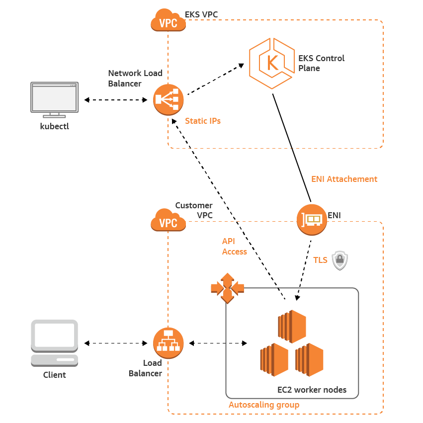

# EKS

In the previous section we managed containers using ECS. In this section we'll continue exploring container management, this time using EKS.

## Intro to Kubernetes

>Kubernetes is a portable, extensible open-source platform for managing containerized workloads and services, that facilitates both declarative configuration and automation. [Kubernetes](https://kubernetes.io/docs/concepts/overview/what-is-kubernetes/#what-kubernetes-and-k8s-mean)

  

| Resource | Description |
|----------|--------------------------------------------------------------------------------------------------------------------------------------------------------------------------------------------------------------------------------------------------------------------------------------------------------------------------------------------------------------------------------------------------------------------------------------------------------------------------------------------------------|
| Pods | The lowest point of organization for Kubernetes is the pod. A pod is a network wrapper around one or more containers though common practice is to use one container per pod. Pods have their own networking layer which allows communication between containers. |
| Nodes | A node is a worker machine in Kubernetes. A node may be a virtual or physical machine depending on the infrastructure. A node can contain a single pod or a collection of multiple pods. Nodes also have their own networking layer which makes pod communication across nodes possible. |
| Services | A service is a REST object similar to a pod that holds all of the networking information for each individual pod. This is because pods are often ephemeral and do not have a static IP address. This makes it so individual pods don't have to worry about the location of every other pod, they can simply route their traffic through a service. |
| Clusters | Clusters are the largest of the organizational structure of Kubernetes. A cluster can contain multiple nodes and has its own networking layer for communication between nodes. |

## Intro to EKS

Similar to ECS, Amazon's Elastic Container Service for Kubernetes (EKS) allows users to manage containers distributed amongst various AWS instances. However, where ECS is an Amazon specific container orchestration tool, EKS utilizes the popular container management platform Kubernetes to manage containers on AWS.

> Amazon Elastic Container Service for Kubernetes (Amazon EKS) is a managed service that makes it easy for you to run Kubernetes on AWS without needing to stand up or maintain your own Kubernetes control plane. Kubernetes is an open-source system for automating the deployment, scaling, and management of containerized applications. [Amazon EKS](https://docs.aws.amazon.com/eks/latest/userguide/what-is-eks.html)

Although AWS provides ECS as a container management tool, the popularity of Kubernetes spurred the creation of EKS. Before EKS, Kubernetes was commonly used in conjunction with AWS resources, so Amazon created EKS to make the integration between Kubernetes and AWS seamless. EKS runs the Kubernetes management infrastructure behind the scenes so that the user only has to worry about adding worker nodes to their cluster. Both vanilla Kubernetes and EKS use `kubectl` as a tool to interact with clusters, so experienced users of Kubernetes will find it easy to transition to EKS. 

## Kubernetes Components

Kubernetes does a lot behind the scenes to manage and maintain the varies workloads that run on a cluster. At the heart of Kubernetes cluster management are the [Kubernetes components](https://kubernetes.io/docs/concepts/overview/components/) that perform these management tasks.
Once you have set your desired state for your cluster, these components work together to make sure that your cluster replicates and maintains this state.

Kubernetes components can be roughly split into two groups:
1. Control plane components make decisions about the cluster at a global level,
such as storing the state of the cluster, or scheduling different workloads.
2. Worker node components are those that need to run on every worker node in
the cluster, such as the agent to start up a Docker container.

#### Control Plane Components

Control plane compoments make global decsions about the cluster. While control
plane components can be run on any machine in a cluster, they are typically all
run on a single machine on which no other container run. A machine that
only runs control plane components is called a control plane node.

[kube-api-server](https://kubernetes.io/docs/reference/command-line-tools-reference/kube-apiserver/) -
The kube-api-server is the component of the control plane that exposes the Kubernetes API.
It acts as the front end of a Kubernetes cluster.

[etcd](https://etcd.io/docs/) - etcd is a key value store, it acts as data storage
for a Kubernetes cluster.

[kube-scheduler](https://kubernetes.io/docs/reference/command-line-tools-reference/kube-scheduler/) -
The kube-scheduler is the process which assigns pods to run on particular worker nodes.

[kube-controller-manager](https://kubernetes.io/docs/reference/command-line-tools-reference/kube-controller-manager/) -
The kube-controller-manager is a collection of different controllers each of which
is handling a separate task, such as responding to worker node failure, or managing
replication of pods. Each controller in the controller-manager follows separate
logic, but they run as a single process for simplicity.

#### Worker Node Components

Worker node components are those that run on every worker node in a cluster.
They manage the cluster on a much more limited scope, controlling only the
machine they run on.

[kubelet](https://kubernetes.io/docs/reference/command-line-tools-reference/kubelet/) -
The kubelet is the primary Kubernetes agent process that runs on each worker node. It
handles tasks such as informing the API server that the node is healthy, and
starting containers that are scheduled to run on the node.

[kube-proxy](https://kubernetes.io/docs/reference/command-line-tools-reference/kube-proxy/) -
The kube-proxy is the networking agent which runs on every worker node in the cluster.
It maintains networking rules on nodes to allow pods to communicate based on
the configuration of the cluster.

## Exercise

In the previous section we launch the SockShop demo on an ECS cluster to demonstrate deploying a microservice application. This exercise will have you deploy SockShop on EKS so you can explore the differences between the two services.

1. Create IAM roles to allow AWS to manage EKS services
  - You will need a role to allow EKS to manage clusters
  - You will need another role to allow EC2 instances to call EKS services(will need to refer to CloudFormation script from AWS tutorial)
2. Install the `aws-iam-authenticator` following these [instructions](https://docs.aws.amazon.com/eks/latest/userguide/install-aws-iam-authenticator.html)
3. Create an EKS cluster
4. Connect your `kubectl` tool to your cluster
5. Create a Launch Configuration and Autoscaling group to launch Kubernetes EC2 images
6. Connect your EC2 instances to your cluster
7. Launch SockShop application on your cluster using the `complete-demo.yaml` in the [microservice-demo](https://github.com/liatrio/microservices-demo) repo

## Deliverables

- Discuss the differences between ECS and EKS
- Explain how services remedy the difficulties of ephemeral pods
- Describe the benefits/drawbacks of using EKS in enterprise
